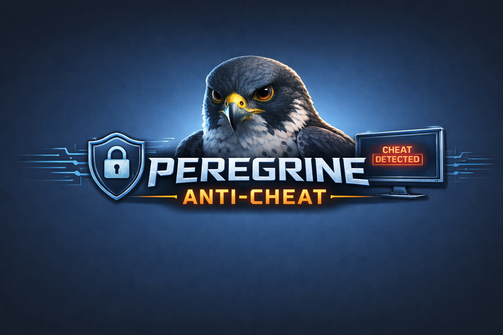

# Peregrine Anti-Cheat

An educational anti-cheat system for learning Windows kernel programming, process monitoring, and cheat detection techniques.

<p align="center">
  
</p>

## Overview

Peregrine is a learning-focused anti-cheat project that demonstrates core concepts in game security and Windows internals. This project implements both kernel-mode and user-mode components to detect common cheating techniques used in games.

## Architecture

### Kernel Component
The kernel driver (`PeregrineKernelComponent`) operates at ring-0 and provides:
- **ObCallback Registration**: Process and thread handle operation monitoring
- **Notify Routines**: Process, thread, and image load notifications
- **IOCTL Communications**: Bidirectional kernel-user communication channel
- **Process Protection**: Protected Process Light (PPL) enforcement
- **Driver Scanning**: Enumerates loaded kernel drivers and checks against a blacklist
- **ObCallback Scanning**: Enumerates registered object callbacks to detect tampering
- **System Integrity Checks**: Test-signing, HVCI, and CPU/hypervisor detection

### User-Mode Components
- **DLL Component** (`PeregrineDLL`): Injected into protected processes for in-process monitoring
- **Userland Service**: Python-based service that manages communication and analysis
- **GUI Interface**: Dark-themed real-time monitoring and control interface with colored log output

## Detection Capabilities

### Current Detections
1. **Module Integrity Checking**
   - Compares `.text` section hashes of in-memory modules against on-disk originals
   - Handles PE base relocations to avoid false positives from ASLR
   - Handles WoW64 path redirection for 32-bit processes on 64-bit Windows
   - Detects runtime code patches, inline hooks, and trampolines

2. **External Memory Access Detection**
   - Hooks `ReadProcessMemory` and `WriteProcessMemory` (kernel32/kernelbase)
   - Hooks `NtReadVirtualMemory` and `NtWriteVirtualMemory` (ntdll)
   - Hooks `VirtualAllocEx` and `VirtualProtectEx` (remote memory manipulation)
   - Hooks `CreateRemoteThread` (remote code execution)
   - Hooks `OpenProcess` (handle acquisition with dangerous access flags)
   - Filters out harmless query-only access to reduce noise

3. **Thread & Shellcode Detection**
   - Detects thread execution originating outside trusted modules
   - Uses kernel-reported Win32 start address for accuracy
   - Identifies shellcode execution in non-module memory regions

4. **Thread Analysis & Module Mapping**
   - Enumerates all threads in a process and checks their instruction pointers (RIP)
   - Maps each thread's execution location to its corresponding module
   - Flags suspicious threads executing from unknown or unmapped memory regions

5. **Handle Access Monitoring**
   - Kernel ObCallback intercepts handle creation/duplication to protected processes
   - Logs dangerous access flags (VM_READ, VM_WRITE, CREATE_THREAD, TERMINATE, etc.)
   - Filters out harmless query-only handle requests

6. **DLL Injection Detection**
   - Monitors image load notifications from the kernel
   - Tracks all modules loaded into protected processes
   - Pre-injection process liveness check to avoid injecting into exited processes

7. **Process Blacklist Scanning**
   - Enumerates all running processes and checks against a keyword blacklist
   - Detects known cheat tools: CheatEngine, x64dbg, IDA, ProcessHacker, etc.

8. **Driver Blacklist Scanning**
   - Enumerates all loaded kernel drivers from ring-0
   - Checks against a blacklist of known cheat/bypass drivers

9. **ObCallback Enumeration**
   - Scans registered object callbacks from ring-0
   - Identifies which drivers have registered process/thread handle callbacks
   - Detects potential callback tampering or unauthorized registrations

10. **IAT Hook Detection**
    - Walks each module's Import Address Table in the target process
    - Flags IAT entries pointing outside all known loaded modules
    - Detects hooks redirecting to shellcode or manually mapped code

11. **EAT Hook Detection**
    - Walks each module's Export Address Table
    - Validates exported function RVAs stay within module bounds
    - Correctly skips legitimate PE forwarder entries

12. **System Integrity Checks**
    - **Test-Sign Detection**: Queries CodeIntegrityOptions to detect test-signing mode
    - **HVCI Detection**: Checks if Hypervisor Code Integrity is enabled or disabled
    - **CPU Vendor / Hypervisor Detection**: CPUID-based check for VM/hypervisor presence

## Protection Features

### Protected Process Light (PPL)
Peregrine can elevate processes to Protected Process Light status:
- **Kernel-Enforced Protection**: PPL processes are protected from unauthorized memory access
- **Anti-Malware Signer**: Uses PPL-Antimalware protection level
- **GUI Control**: Set processes to PPL status with one click

## Technical Stack

- **Kernel Driver**: C (WDM/WDF)
- **DLL Component**: C/C++ with MinHook for API hooking
- **Userland Service**: Python 3 with Tkinter GUI
- **IPC Mechanism**: Named pipes
- **Kernel Communication**: IOCTL (I/O Control) codes

## Components

```
src/
├── PeregrineKernelComponent/    # Kernel driver (ring-0)
│   ├── obCallback.c             # Object callback routines
│   ├── NotifyRoutine.c          # Process/thread/image notifications
│   ├── Coms.c                   # IOCTL communication handler
│   ├── Protection.c             # PPL implementation
│   ├── AppState.c               # Driver state management
│   ├── DriverScan.c             # Loaded driver enumeration & blacklist
│   ├── ObCallbackScan.c         # ObCallback enumeration
│   └── SystemCheck.c            # Test-sign, HVCI, CPU/hypervisor checks
│
├── PeregrineDLL/                # User-mode DLL (x86 + x64)
│   ├── dllmain.cpp              # Hook setup and detour functions
│   └── ipc.c                    # Generic IPC event logging
│
└── Userland/                    # Python service layer
    ├── peregrine_gui.py         # Dark-themed GUI with colored logs
    ├── IPC.py                   # Named pipe IPC server
    ├── DLL.py                   # DLL injection (LoadLibraryA, x86/x64 aware)
    ├── PatchDetection.py        # Module integrity checking with relocation handling
    ├── threadWork.py            # Thread analysis
    ├── ProcessBlacklist.py      # Process blacklist scanning
    ├── HookDetection.py         # IAT and EAT hook detection
    └── self_tamper.py           # Self-integrity checks
```

## Building

Run `build_dll.bat` from the project root to build everything:

```batch
build_dll.bat
```

This builds:
- `PeregrineDLL_x64.dll` (Release x64)
- `PeregrineDLL_x86.dll` (Release x86)
- `PeregrineKernelComponent.sys` (Release x64)

All outputs are copied to `src/Userland/` where the Python GUI expects them.

### Requirements
- Windows 10/11 (x64)
- Visual Studio 2022 with C++ workload
- Windows Driver Kit (WDK)
- Python 3.8+
- Test signing enabled (`bcdedit /set testsigning on`)

## Usage

### Starting the Driver
```
sc.exe create PeregrineKernelComponent type= kernel binPath= "C:\path\to\PeregrineKernelComponent.sys"
sc.exe start PeregrineKernelComponent
```

### Running the GUI
```
cd src/Userland
python peregrine_gui.py
```
The GUI auto-elevates to administrator if needed.

### GUI Controls
- **Add/Remove PIDs**: Protect specific processes by PID
- **Set PPL**: Elevate processes to Protected Process Light status
- **Check Modules**: Scan a process for module tampering
- **Check Threads**: Analyze thread execution locations
- **Scan Blacklist**: Scan all running processes for known cheat tools
- **Scan Drivers**: Enumerate loaded kernel drivers and check blacklist
- **Scan ObCallbacks**: Enumerate registered object callbacks
- **Check IAT**: Scan for Import Address Table hooks
- **Check EAT**: Scan for Export Address Table hooks
- **System Check**: Test-signing, HVCI, and hypervisor detection

## Disclaimer

This project is **strictly for educational purposes**. It demonstrates security concepts and Windows internals for learning and research. Use only in controlled environments with proper authorization.

## License

This is an educational project. Use responsibly and ethically.
